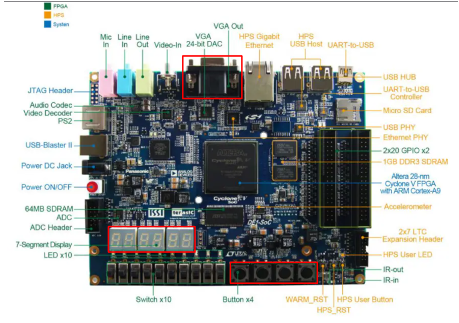
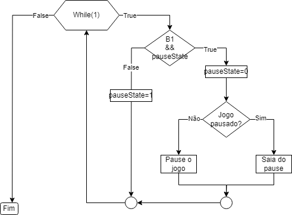
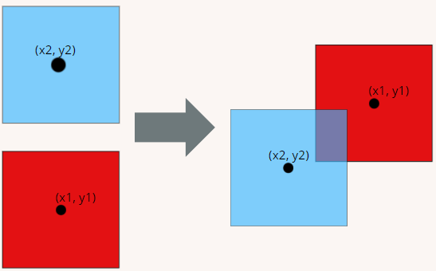

# Sistema digital
## 1-Introdução: 
Atualmente, os jogos eletrônicos estão se tornando cada vez mais populares. De acordo com um relatório da consultoria Newzoo, até o final de 2023, o número de jogadores pode ter atingido 3,3 bilhões, o que representa mais de 40% da população mundial. No aspecto econômico, estima-se que esse número de jogadores tenha gerado cerca de US$188 bilhões no ano passado.
O Brasil também segue essa tendência global, sendo o principal mercado de jogos da América Latina desde 2021. Aproximadamente 70% da população brasileira participa de algum tipo de jogo, de acordo com a Pesquisa Game Brasil (PGB) de 2023.
Nesse contexto, foi proposto o desenvolvimento de um jogo utilizando a linguagem C, empregando o módulo kernel criado no Problema 2 para comunicação com a unidade de processamento gráfico (GPU). O objetivo é criar sprites personalizados para o jogo. O controle do jogo será feito por meio do mouse, e as informações da partida, como vidas e quantidade de pontos do jogador, serão exibidas em um display de 7 segmentos.

## 2- Descrição dos equipamentos e softwares utilizados:

* Placa DE1-SoC
	- O kit de desenvolvimento DE1-SoC é uma placa que combina um processador ARM Cortex-A9 dual-core com um FPGA Cyclone V da Intel. Este kit oferece uma ampla gama de periféricos, incluindo portas VGA, Ethernet, USB e de áudio, o que a torna ideal para projetos que integram tanto software quanto hardware. É amplamente utilizado em ambientes educacionais e de pesquisa para o desenvolvimento e aprendizado em sistemas embarcados e FPGA, fornecendo uma plataforma robusta e versátil para experimentação e prototipagem.

* Monitor CRT
	- O monitor utilizado no projeto é o DELL M782p, um modelo CRT. Esse tipo de monitor usa um tubo de raios catódicos (CRT) para exibir imagens. O DELL M782p possui uma tela de 17 polegadas e uma resolução máxima de 1280x1024 pixels. Ele oferece uma interface VGA para conexão com o computador ou a placa de desenvolvimento.

* Linguagem C
	- A linguagem escolhida para a codificação do projeto foi C, devido a sua portabilidade para computadores que não possuam recursos tecnológicos avançados o suficiente para softwares mais pesados. Além disso, seu nível de abstração mais próximo da máquina e suas bibliotecas-padrão que auxiliam a interação com o sistema operacional, agem em conjunto para tornar mais prática a manipulação dos drivers dos dispositivos usados no sistema.

* Visual Studio Code (VSCode)
	- O Visual Studio Code, conhecido como VSCode, é um editor de código-fonte amplamente utilizado e desenvolvido pela Microsoft. É um editor gratuito e de código aberto que oferece uma variedade de recursos. O VSCode é compatível com diversas linguagens de programação e pode ser altamente personalizado por meio de extensões. No projeto, o VSCode foi utilizado para desenvolver o código-fonte do jogo.

## 3- Conceitos importantes:

* GPU
	- Unidade de processamento gráfico, também conhecida como GPU, é um componente eletrônico projetado para acelerar tarefas relacionadas à computação gráfica e ao processamento de imagens em uma ampla gama de dispositivos, incluindo placas de vídeo, placas-mãe, smartphones e computadores pessoais (PCs). A capacidade da GPU de realizar cálculos matemáticos complexos de forma rápida e eficiente reduz significativamente o tempo necessário para que um computador execute uma variedade de programas.(Caso de dúvidas, consultar o Problema 2)

* Módulo kernel
	- Um módulo de kernel é uma parte do sistema operacional que pode ser carregada e descarregada dinamicamente, permitindo adicionar ou remover funcionalidades sem precisar reiniciar o sistema. No contexto de Linux, esses módulos são usados para gerenciar hardware, como drivers de dispositivos, e executar tarefas específicas, aprimorando a flexibilidade e eficiência do sistema operacional.(Caso de dúvidas, consultar o Problema 2)

* Thread
	- Uma thread é a menor unidade de processamento de um programa, permitindo a execução simultânea de várias tarefas dentro de um mesmo processo. As threads compartilham recursos como memória, mas têm suas próprias pilhas de execução. Isso permite que programas façam multitarefas de forma eficiente, melhorando o desempenho e a capacidade de resposta. As threads são amplamente usadas em aplicações que exigem operações concorrentes, como servidores web e interfaces gráficas.

* Colisão em jogos
	- Uma colisão refere-se ao evento em que dois ou mais objetos, personagens ou entidades no jogo se encontram ou se sobrepõem de maneira significativa. A detecção e a manipulação de colisões são fundamentais para a mecânica e a jogabilidade nos jogos, afetando como os elementos do jogo interagem entre si e com o ambiente.

## 4- Periféricos da Placa DE1-SoC Utilizados:

A seguir, serão apresentadas as descrições gerais dos periféricos utilizados na placa DE1-SoC. A figura abaixo mostra a placa FPGA, com indicações dos dispositivos que serão descritos.

<strong> Periféricos. </strong>

  

<strong>Fonte: Autores
</strong>

   
* Saída VGA:
	- A saída VGA (Video Graphics Array) é uma interface padrão para transmitir sinais de vídeo de dispositivos como computadores para monitores. Ela utiliza um conector de 15 pinos e suporta resoluções de vídeo de até 640x480 pixels, mas também pode ser usada para resoluções mais altas. É uma tecnologia analógica, o que significa que a qualidade da imagem pode ser afetada por interferências.
* Display de 7 seg:
	- Um display de sete segmentos, como seu nome indica, é composto de sete elementos, os quais podem ser ligados ou desligados individualmente. Eles podem ser combinados para produzir representações de número e/ou letras. 
* Botões
	- A placa dispõe de quatro botões para a utilização. Quando um botão é pressionado, o bit correspondente é setado para 1, e quando o botão é solto, o bit é setado para 0.
## 5- Conceito do jogo e suas regras:
O jogo desenvolvido possui caráter autoral e representa uma criação inédita, intitulada Alien, Bomb & Fruit.
No jogo, um alienígena se perde em um planeta desconhecido e estranho, onde, por motivos inexplicáveis, bombas, diamantes e frutas caem do céu. Para sobreviver, o alienígena deve destruir as bombas e os diamantes afiados com sua arma de laser, enquanto come as frutas para sobreviver.

* Regras do jogo:
	- O jogador começa com 5 vidas.
	- O jogador pode disparar apenas um tiro por vez, até acertar um alvo ou sair da área de visão.
	- O objetivo é destruir as bombas antes que eles atinjam o chão ou o alienígena, para evitar perder vidas.
	- Se o jogador acertar uma fruta ou permitir que ela caia no chão, perderá uma vida.
	- O jogador deve posicionar o alienígena na direção das frutas para comê-las e ganhar pontos.
	- O jogador deve posicionar o alienígena na direção do diamante para ganhar vidas.

## 6- Fluxo do jogo:

Início do Jogo:
* O jogador inicia o jogo pressionando o botão início na DE1-SoC.
  
Durante o Jogo
* Movimentação e Ação: O jogador controla o alienígena usando movimento do mouse limitado em movimentar apenas na horizontal e apertando o botão esquerdo para fazer o disparo da arma laser.
* Ações do Jogo:
	- Destruir Bombas e Diamantes: O jogador dispara tiros para destruir bombas e diamantes.
	- Coletar Frutas: O jogador posiciona o alienígena para coletar frutas e ganhar pontos.
* Controle de Jogo:
 	- Pausa: O jogador pressiona o botão para pausar o jogo. O jogo é parado e  exibe a tela de pausa.
	- Retorno: Durante a pausa, o jogador pode pressionar o botão de "Continuar" para retomar o jogo a partir do ponto em que foi pausado.
	- Reinício: O jogador pode pressionar o botão de reiniciar para voltar ao jogo desde o início.

Tela de Pausa
* O jogo é interrompido e a tela de pausa é exibida.
  
Fim do Jogo
* O jogo termina se o jogador perder todas as vidas ou atingir 100 pontos.

## 7- Implementando o Jogo:

* Usando Threads:
	* Captura de dados contínua do mouse
		- Para mover o personagem na tela, bem como atirar, foi lido o arquivo do event 0. Nesse arquivo é possível capturar tanto as cordenadas X-Y quanto o ''click'' do mouse.(Para entender mais, consultar o Problema 1). O problema que a leitura do arquivo é feito por uma chamada de sistema (read), que quando não tem dados para serem lidos, trava o fluxo do programa na linha do código referente a leitura. Sendo assim, para não atrapalhar a lógica de funcionamento do jogo em si, foi separado a lógica de leitura dos dados do mouse em uma thread, que lerá os dados e passará para a ''Thread principal'', que é a responsável pela a lógica do jogo.
	* Interagindo com os botões
   		- Para os botões também foi implementada uma Thread. Essa thread carrega em si toda a lógica de captura de dados referentes aos botões - desde o mapeamento até a implementação de conceitos de máquinas de estado para obtenção dos dados. Como o laço gira infinitamente, o ato de pressionar o botão seria lido diversas vezes o que poderia ocasionar problemas, como no caso do botão pause, que também é responsável por ''despausar''. Para tratar disso foi criado uma variável de estado chamada "pauseState". Ela que vai limitar o ato de apertar o botão a uma só captura, o fluxograma abaixo ilustra seu funcionamento:
  
		
<strong>Funcionamento do botão pause. </strong>

		

		  
		

		
<strong>Fonte: Autores
		</strong>

  
  		- O botão pause é o mais complexo dos 4, pois faz duas ações. Para os outros 3, a implementação é ligeraimente mais simples, mas utiliza conceitos parecidos.
	* Thread principal - O jogo
		- Toda lógica do jogo é feita nessa parte.
			-  Movimento dos Sprites: Para movimentar os sprites, as variáveis X e Y pertencente a esses sprites são modificadas e uma instrução que lida com sprite é enviado para GPU, atualizando assim o Sprite na tela. Todos os sprites (jogador, tiro, bombas, frutas e diamantes) se movimentam dessa forma. O Fluxograma abaixo demonstra o funcionamento do movimento do player.

			
<strong> Movimento do player. </strong>

			

			  
			

			
<strong>Fonte: Autores
			</strong>

   
  			- Aumento de dificuldade: O jogo tem um sistema de ''balanceamento''. No início, existe somente um ''elemento de queda''. A cada 5 pontos é adicionado outro Sprite à queda, até que 9 ''elementos em queda'' estejam na tela. Existe também uma lógica de aumento de velocidade a cada 15 pontos, mas que é limitada depois de 2 vezes usada.
			- Lógica de colisão: Foi implementada um sistema de colisão. Essa colisão é aplicada entre o tiro e algum "elemento em queda" ou entre algum "elemento em queda" e o player.

				
<strong> Colisão. </strong>

				

				  
				

				
<strong>Fonte: Autores
				</strong>

   
			- Verificando altura dos elementos: Se os elementos atravessarem a linha que o player deve defender, uma vida é perdida.
			- "Quebra do score" e exibição no display de 7-segmentos: O score é "quebrado" em unidades, dezenas e centenas, esses valores são associados a um binário referente a esse número (na notação do 7-segmento) que é passado para os displays. O mesmo é feito para vida, com a diferença que a vida está limitada somente a unidade.

			
<strong> Exibindo no display. </strong>

			

			  
			

			
<strong>Fonte: Autores
			</strong>

   
			- Aleatoridade dos Sprites (Eixo x): Os sprites que caem recebem valores aleátorios e fixos para o eixo X, movendo-se somente na vertical, em queda.

## 8- Testes:
<ul>	
	<li>Exibição de pontos e vidas no display de 7 segmentos</li>
	

	<li>Player pega fruta e ganha ponto</li>

https://github.com/user-attachments/assets/0f56f44d-a7ed-4b19-90dd-b9d1e7e8be4e

<li>Player pega bomba e perde vida</li>

 

<li>Player dá tiro em fruta e perde vida</li>
 

https://github.com/user-attachments/assets/6283e144-3a0a-4493-baea-1b328be74bbb

<li>Player dá tiro em bomba e ganha ponto</li>
 

https://github.com/user-attachments/assets/0f2626ef-894a-4827-beb8-1264f83e8525

<li>Player dá tiro em diamante e perde vida</li>
 

https://github.com/user-attachments/assets/15597602-d2fa-49f1-9999-d55cf04e16ab

<li>Player deixa qualquer item cair e perde vida</li>
 

https://github.com/user-attachments/assets/11fa8e7e-8dab-406f-87ed-854cb09091e9

<li>Número de elementos na tela aumenta a cada 5 pontos</li>
 

https://github.com/user-attachments/assets/e8c626f0-41af-4bed-813b-1b80442ae8b9

<li>Player morre com 0 vidas</li>
 

https://github.com/user-attachments/assets/00a7a7d7-8496-4484-b541-10689928de71

<li>Player pode reiniciar, pausar, sair, começar o jogo</li>
 

</ul>

## 9- Conclusão:
O desenvolvimento do jogo foi concluído com sucesso. A implementação atendeu  todos os requisitos estabelecidos. O alienígena se move corretamente na horizontal, os tiros são disparados e o jogador está restrito aos limites da tela. O placar de vidas e pontos é exibido corretamente no display de 7 segmentos. 
Além disso, as ações de iniciar, pausar, continuar, reiniciar e encerrar o jogo funciona conforme projetado, permitindo ao jogador uma interação dinâmica com o jogo. A validação das funcionalidades foi bem-sucedida, e todas as interações foram implementadas de acordo com as especificações.
Os testes realizados evidenciaram a eficiência e confiabilidade do sistema, validando sua capacidade de operar de forma consistente em diversas condições de jogo.
Este projeto, além de alcançar seus objetivos iniciais, proporcionou um aprofundamento significativo dos conhecimentos em sistemas embarcados e arquitetura ARM. Ele capacitou os desenvolvedores a conciliar aspectos tanto de software quanto de hardware, estabelecendo uma base sólida para futuras explorações nas áreas de sistemas digitais e desenvolvimento de software.

## 10- Referências:
 
https://pinboard.opera.com/view/13ed1720-4607-4ad7-8c6c-518e6695adf4

 

